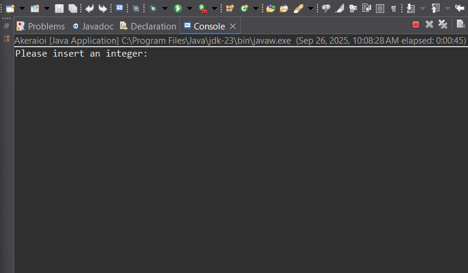

## Demo

This simple arithmetic program in Java, as seen in the brief Akeraioi.demo, reads two integers from the console and returns a result based on the value of the first number. 
If the first number is positive, the program returns the sum of the two numbers. Otherwise, it returns the difference of the second from the first.

Functionality:

• The program is executed by the class Akeraioi within the akeraioi package.

• It reads two integer values using the Scanner class.

• It calls the method akeraioi(int x, int y) to calculate the result.

• It displays the final result on the console with formatting.

Main methods and roles: 

• main: Manages user input and calls the calculation method. 

• akeraioi(int x, int y): Returns x + y when x > 0 and x - y in all other cases.

Example execution:

• Input:

• First number: 5

• Second number: 3

• Output: The final result is: 8

• Input:

• First number: -2

• Second number: 4

• Output: The final result is: -6

Usage:
1. Clone or download the repository.
2. Navigate to the source folder and run the Akeraioi class.
3. Enter two integers when prompted.
4. Observe the result in the console.

Suggested improvements:

• Closing the Scanner: add after use to avoid resource leaks.

• Input validation: handle InputMismatchException and recall until a valid value.
